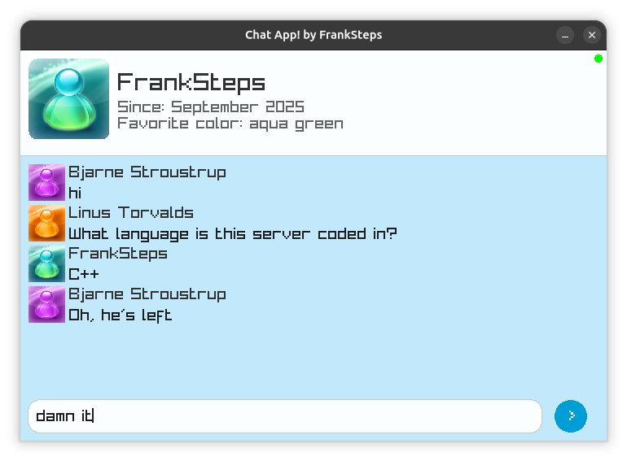

# Chat Up!
Chat Up! is a real-time chat application with a Frutiger Aero aesthetic, enabling message exchange between devices on the same local network.

## Screenshots
### Desktop App


### Browser Client


## Features
- Local C++ HTTP server
- Real-time messaging across network devices
- Frutiger Aero design aesthetic
- Avatar support and user profiles
- Message history (last 4 messages displayed)

## Requirements
- g++ (C++17)
- make
- raylib

## Installation & Usage
```bash
git clone https://github.com/FrankSteps/chat-up.git
cd chat-up
make
make run
```

Server runs on `http://localhost:5000`

## Current Limitations
- No authentication or encryption
- Messages stored in memory (lost on restart)
- Local network only
- Under active development

## License
MIT License - See [LICENSE](LICENSE) file for details