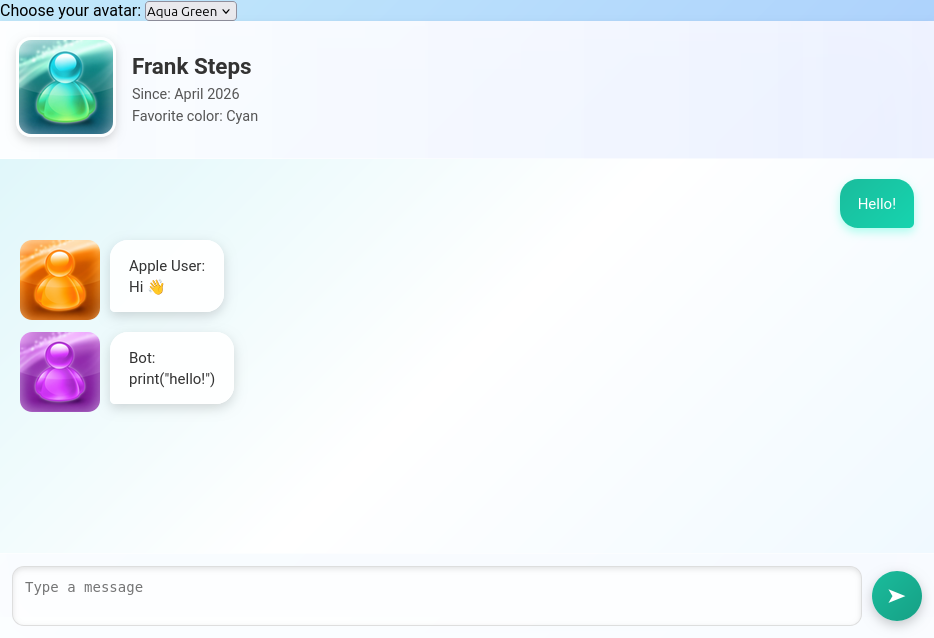

# Chat Up!

Chat Up! is a chat application inspired by the Frutiger Aero aesthetic.



## Features

- Local server written in C++
- Send messages between devices on the same network
- Frutiger Aero aesthetic


## Dependencies
* g++
* make
* raylib (required if windowOpen is true)
> If you don't want to open the window, set `windowOpen` to `false` in `backend/server.cpp`. Raylib is not required in that case.


## Build and Run

```bash
git clone https://github.com/FrankSteps/chat-up.git
cd chat-up
make
make run
```

## Notes

> Runs on a local server in port 5000
> There is currently no authentication or encryption.
> The project is still under development.

## License

This project is licensed under the MIT License. See the [LICENSE](LICENSE) file for details.
